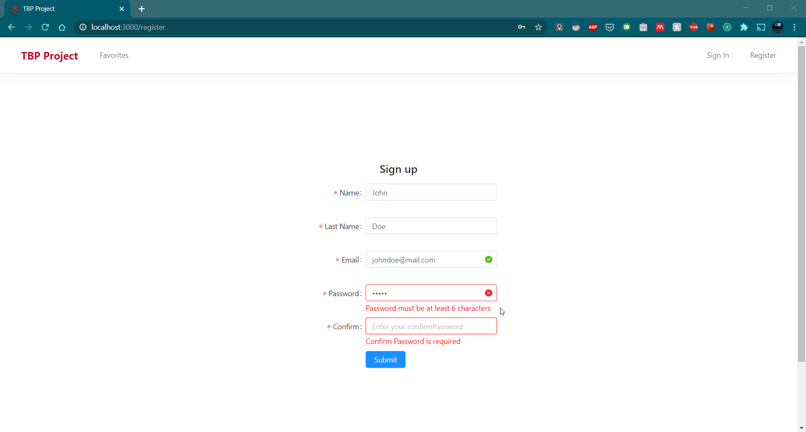
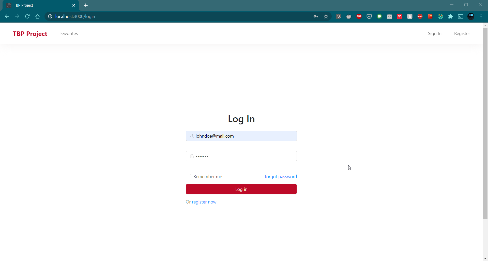
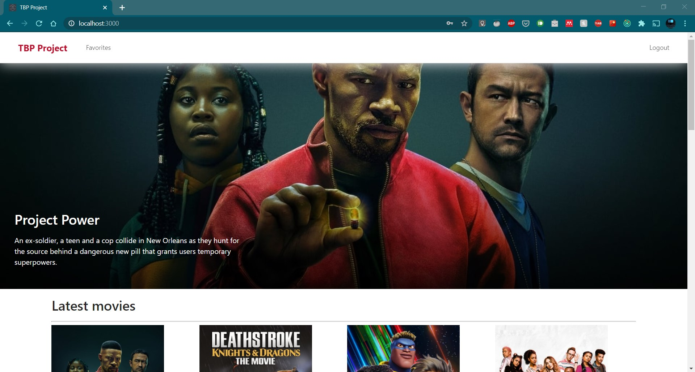
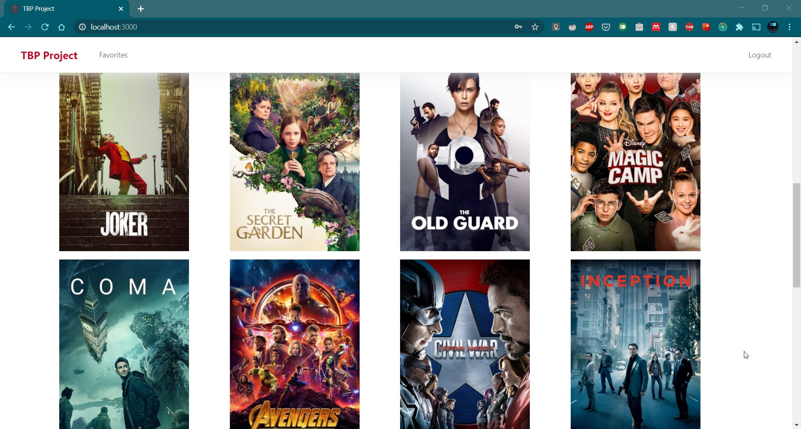
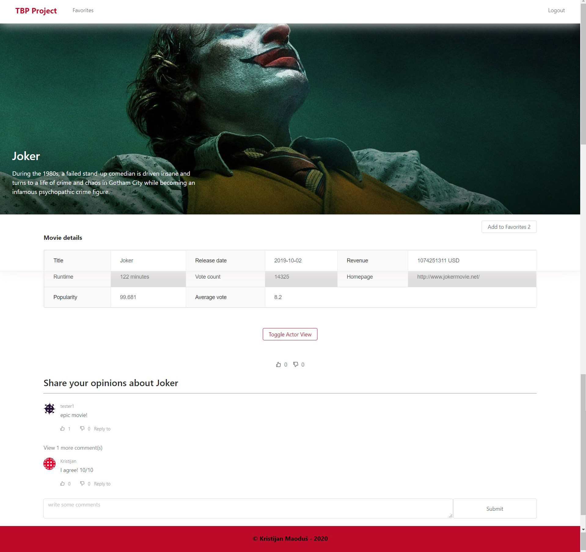
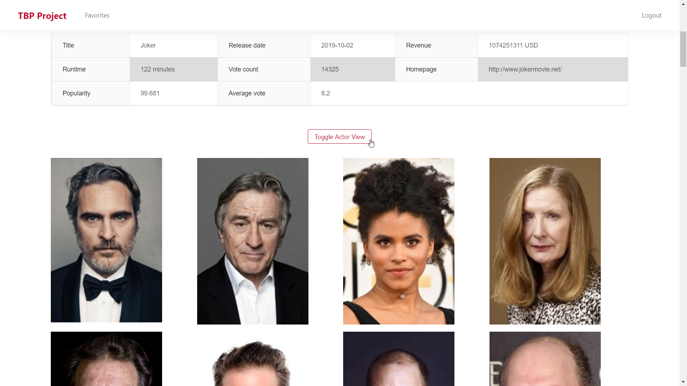
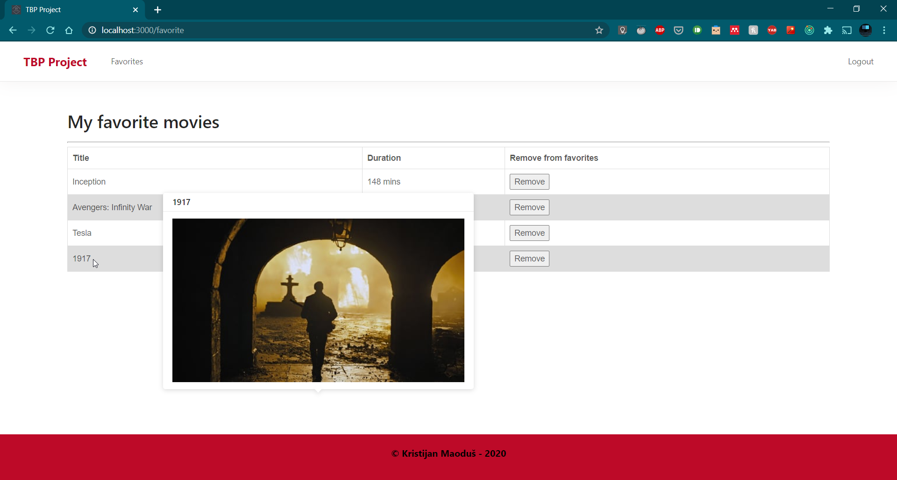

<!-- PROJECT SHIELDS -->

<!--

*** I'm using markdown "reference style" links for readability.

*** Reference links are enclosed in brackets [ ] instead of parentheses ( ).

*** See the bottom of this document for the declaration of the reference variables

*** for contributors-url, forks-url, etc. This is an optional, concise syntax you may use.

*** https://www.markdownguide.org/basic-syntax/#reference-style-links

-->

<!-- [![Contributors][contributors-shield]][contributors-url]

[![Forks][forks-shield]][forks-url]

[![Stargazers][stars-shield]][stars-url]

[![Issues][issues-shield]][issues-url]

[![MIT License][license-shield]][license-url]

[![LinkedIn][linkedin-shield]][linkedin-url] -->

<!-- PROJECT LOGO -->

<br />

<p align="center">

<a href="https://github.com/kmaodus/moviesMERN">

<!--  -->

</a>

<h3 align="center">College project (TBP) - FOI 2020</h3>

<p align="center">

Project for Database theory course at Faculty of Organization and Informatics

<br />

</p>

<!-- TABLE OF CONTENTS -->

## Table of Contents

- [About the Project](#about-the-project)

- [Built With](#built-with)

- [Getting Started](#getting-started)

- [Prerequisites](#prerequisites)

- [Installation](#installation)

- [Usage](#usage)

- [Roadmap](#roadmap)

- [Contributing](#contributing)

- [License](#license)

- [Contact](#contact)

<!-- ABOUT THE PROJECT -->

## About The Project

Practicing MERN stack. TMDb API used for this project. --> https://www.themoviedb.org/

### Built With

- [MongoDB]()

- [ExpressJS]()

- [ReactJS]()

- [NodeJS]()

<!-- GETTING STARTED -->

## Getting Started

To get a local copy up and running follow these simple steps.

### Prerequisites

This is an example of how to list things you need to use the software and how to install them.

- npm

```sh

npm install npm@latest -g

```

### Installation

1. Clone the moviesMERN

```sh

git clone https://github.com/kmaodus/moviesMERN.git

```

2. Install server NPM packages (inside root folder)

```sh

npm install

```

3. Install NPM packages in client directory

```sh
cd client

npm install


```

4. Cd back to root directory and run

```sh
cd ..
npm start

```

<!-- USAGE EXAMPLES -->

## Usage

You can register if you want to add movies in your favorites list, otherwise you can view latest popular movies and view detailed movie info by clicking on an image. If you are logged in you can also leave comments and likes on a movie.









<!-- ROADMAP -->

## Roadmap

See the [open issues](https://github.com/kmaodus/moviesMERN/issues) for a list of proposed features (and known issues).

<!-- CONTRIBUTING -->

## Contributing

Contributions are what make the open source community such an amazing place to be learn, inspire, and create. Any contributions you make are **greatly appreciated**.

1. Fork the Project

2. Create your Feature Branch (`git checkout -b feature/AmazingFeature`)

3. Commit your Changes (`git commit -m 'Add some AmazingFeature'`)

4. Push to the Branch (`git push origin feature/AmazingFeature`)

5. Open a Pull Request

<!-- LICENSE -->

## License

Distributed under the MIT License.

<!-- CONTACT -->

## Contact

Project Link: [https://github.com/kmaodus/moviesMERN](https://github.com/kmaodus/moviesMERN)

<!-- ACKNOWLEDGEMENTS -->

<!-- MARKDOWN LINKS & IMAGES -->

<!-- https://www.markdownguide.org/basic-syntax/#reference-style-links -->

[contributors-shield]: https://img.shields.io/github/contributors/othneildrew/Best-README-Template.svg?style=flat-square
[contributors-url]: https://github.com/othneildrew/Best-README-Template/graphs/contributors
[forks-shield]: https://img.shields.io/github/forks/othneildrew/Best-README-Template.svg?style=flat-square
[forks-url]: https://github.com/othneildrew/Best-README-Template/network/members
[stars-shield]: https://img.shields.io/github/stars/othneildrew/Best-README-Template.svg?style=flat-square
[stars-url]: https://github.com/othneildrew/Best-README-Template/stargazers
[issues-shield]: https://img.shields.io/github/issues/othneildrew/Best-README-Template.svg?style=flat-square
[issues-url]: https://github.com/othneildrew/Best-README-Template/issues
[license-shield]: https://img.shields.io/github/license/othneildrew/Best-README-Template.svg?style=flat-square
[license-url]: https://github.com/othneildrew/Best-README-Template/blob/master/LICENSE.txt
[linkedin-shield]: https://img.shields.io/badge/-LinkedIn-black.svg?style=flat-square&logo=linkedin&colorB=555
[linkedin-url]: https://linkedin.com/in/othneildrew
[product-screenshot]: images/screenshot.png
